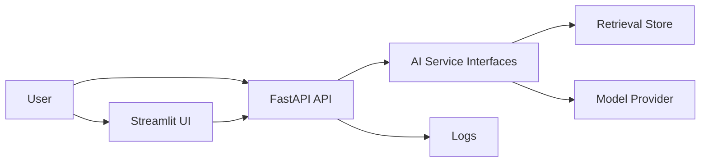
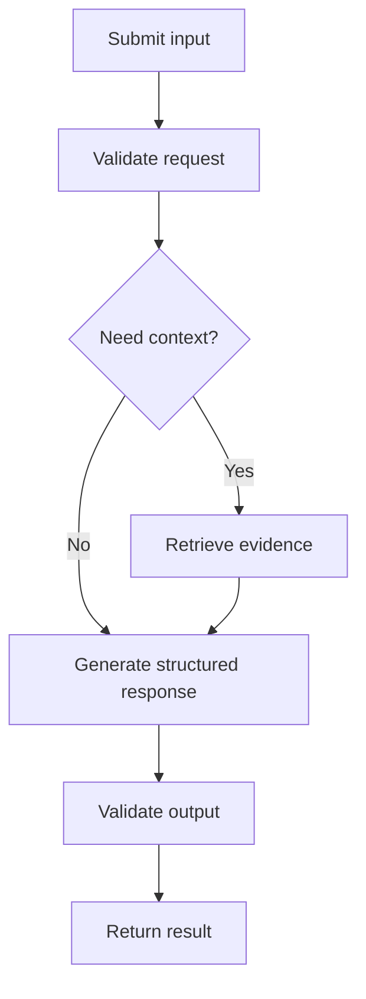
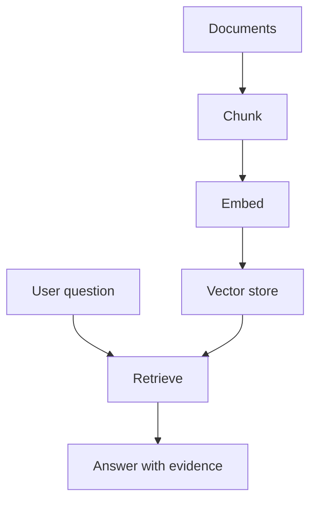
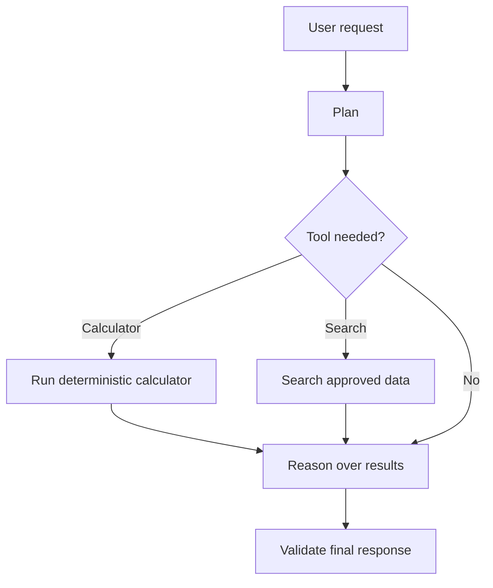
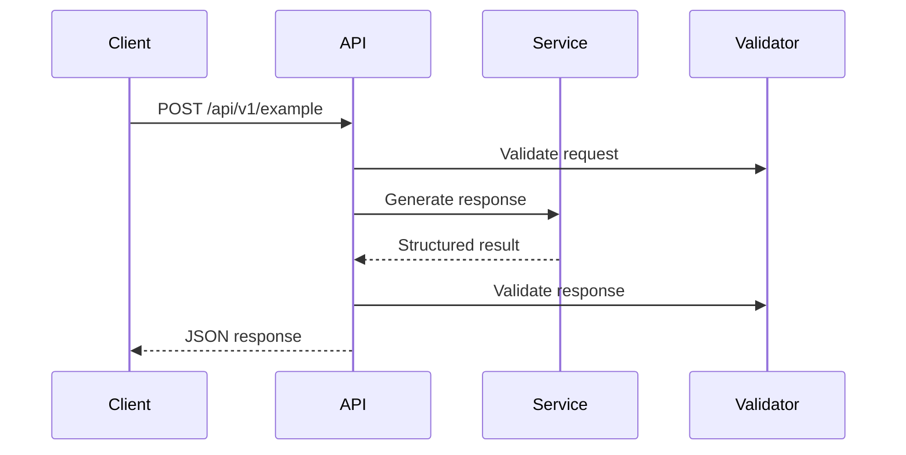
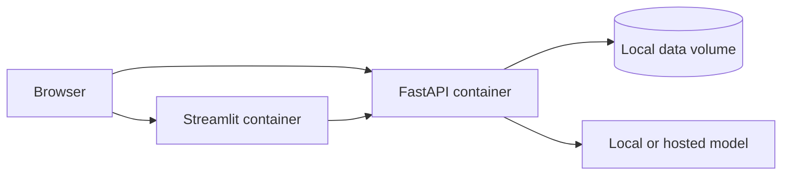

# Architecture

## System Architecture

```mermaid
flowchart LR
    User[User] --> UI[Streamlit UI]
    User --> API[FastAPI API]
    UI --> API
    API --> Services[AI Service Interfaces]
    Services --> Retrieval[Retrieval Store]
    Services --> Model[Model Provider]
    API --> Logs[Logs]
```

## User Workflow

```mermaid
flowchart TD
    A[Submit input] --> B[Validate request]
    B --> C{Need context?}
    C -->|Yes| D[Retrieve evidence]
    C -->|No| E[Generate structured response]
    D --> E
    E --> F[Validate output]
    F --> G[Return result]
```

## RAG Pipeline

```mermaid
flowchart TD
    D1[Documents] --> D2[Chunk]
    D2 --> D3[Embed]
    D3 --> D4[Vector store]
    Q1[User question] --> Q2[Retrieve]
    D4 --> Q2
    Q2 --> Q3[Answer with evidence]
```

## Agent Tool-Calling Workflow

```mermaid
flowchart TD
    U[User request] --> P[Plan]
    P --> T{Tool needed?}
    T -->|Calculator| C[Run deterministic calculator]
    T -->|Search| S[Search approved data]
    C --> R[Reason over results]
    S --> R
    T -->|No| R
    R --> V[Validate final response]
```

## API Sequence Diagram

```mermaid
sequenceDiagram
    participant Client
    participant API
    participant Service
    participant Validator
    Client->>API: POST /api/v1/example
    API->>Validator: Validate request
    API->>Service: Generate response
    Service-->>API: Structured result
    API->>Validator: Validate response
    API-->>Client: JSON response
```

## Deployment Architecture

```mermaid
flowchart LR
    Browser[Browser] --> Web[Streamlit container]
    Browser --> Api[FastAPI container]
    Web --> Api
    Api --> Volume[(Local data volume)]
    Api --> Model[Local or hosted model]
```

